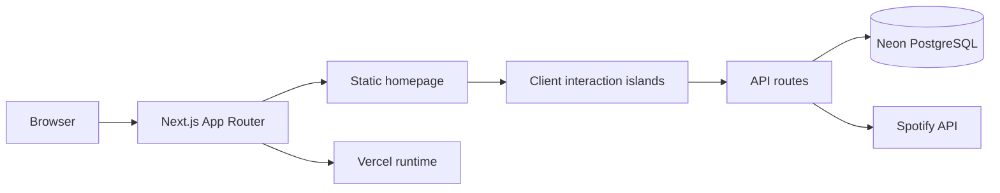

# Shikhar Sahay Portfolio

This repository powers [shikharsahay.vercel.app](https://shikharsahay.vercel.app/), a long-form portfolio for Shikhar Sahay. It is built to feel closer to a directed editorial experience than a resume page: warm paper and ink, one vermilion accent, real project artifacts, physical motion, and a few personal corners that make the site worth exploring.

The facts still need to be easy to find. The experience around them is the point.

## What The Site Contains

- Opening signal line with once-per-session behavior and a reduced-motion skip.
- Hero with an editorial arch portrait, pointer-reactive display type, tagline, and metadata.
- BUILD, BREAK, REBUILD statement bridge between the hero and About.
- About, Experience, Toolkit, Certifications, Projects, Pieces of Me, Notes Wall, Contact, and footer chapters.
- Real project artwork and truthful project actions.
- Full-bleed public Notes Wall with persisted notes, one-level replies, spatial panning, and discovery controls.
- Show recommendation form inside Side Quests.
- Spotify listening panel powered by a server-side integration.
- Light and dark themes, keyboard access, touch behavior, and reduced-motion alternatives.

## Stack

- Next.js 14 App Router
- React 18
- TypeScript strict
- Tailwind CSS 3
- Motion for scroll, entrance, and interaction choreography
- Vercel for deployment
- Neon PostgreSQL via `@neondatabase/serverless`
- pnpm 9

No GSAP, Lenis, Three.js, UI kit, analytics script, or client-side database credential is used.

## Architecture



The homepage is static-first. Most content comes from typed files in `src/content/` and static assets in `src/assets/`. Client components are used only where the page needs animation, gestures, local state, or live UI.

Key client islands:

- `Opening`: session-gated micro-opening.
- `Hero` and `TransitionStatements`: pointer and scroll choreography.
- `SiteNav` and `ThemeToggle`: active navigation, menu, theme persistence.
- `Experience`, `Projects`, `Certifications`, `Personality`, `NotesWall`, `FooterClock`, and `FooterWordmark`: section-specific interaction.

Server routes handle persistence and integrations:

- `GET /api/notes`: list wall notes, optionally bounded by viewport.
- `POST /api/notes`: create top-level notes.
- `POST /api/notes/[id]/replies`: create one-level replies.
- `GET /api/notes/latest` and `GET /api/notes/random`: discovery targets.
- `POST /api/notes/moderate`: secret-gated moderation.
- `POST /api/shows/recommend`: show recommendation matching and persistence.
- Spotify routes: server-side token and listening data access, no browser secret exposure.

## Notes Wall

The Notes Wall is a public spatial surface backed by PostgreSQL. Notes keep practical persisted coordinates, and replies stay attached to their parent note. Users can pan empty wall space or drag through note bodies; controls, inputs, reply surfaces, and buttons opt out so normal interaction still works.

Security and abuse controls are server-side:

- Top-level notes: 2 successful posts per IP per rolling 10 minutes, with a 60 second minimum gap.
- Replies: 6 successful posts per IP per rolling 10 minutes, with a 10 second minimum gap.
- Duplicate protection: exact normalized duplicate keys per IP and post kind for 120 seconds.
- Invalid requests and failed writes do not record quota events.
- Public JSON bodies are bounded before validation, including 413 handling for oversized requests.
- User content is rendered as React text, not as trusted HTML.

Failure states are local to the relevant composer, preserve drafts where appropriate, and use restrained wall-native copy instead of raw backend errors.

## Persistence

Database migrations live in `db/`:

- `001_wall_notes.sql`: wall notes, replies, indexes, and supporting tables for a fresh database.
- `002_show_recommendations.sql`: show recommendation persistence.
- `003_wall_post_events.sql`: durable Notes Wall post events for existing databases.

Neon is the intended production database. The site does not poll or keep the database warm, so Neon can scale to zero naturally.

## Security Baseline

`next.config.mjs` applies route-wide headers:

- Content Security Policy scoped to the origins and features the app uses.
- `frame-ancestors 'none'` and `X-Frame-Options: DENY`.
- `X-Content-Type-Options: nosniff`.
- `Referrer-Policy: strict-origin-when-cross-origin`.
- A deny-by-default Permissions-Policy for sensitive device APIs.
- HSTS for the HTTPS-only production deployment.

The CSP allows self-hosted scripts plus the inline scripts Next needs for production bootstrap and RSC payloads, self fonts, inline styles for framework style injection, self images plus data/blob and Spotify artwork from `i.scdn.co`, and same-origin connections in production.

## Responsive And Motion System

Mobile is not treated as a collapsed desktop. The hero has portrait, tablet, desktop, and short-landscape strategies. The statement bridge uses a compact mobile cut so BUILD, BREAK, REBUILD, and About stay connected without blank scroll zones, while desktop keeps its larger cinematic travel.

Reduced motion gets a complete version of the page: the opening skips pre-paint, hero pinning is removed, statement content becomes static, carousel controls use native scrolling, and decorative motion collapses to simple states.

## Local Development

```bash
pnpm install
pnpm dev
pnpm typecheck
pnpm lint
pnpm format:check
pnpm build
pnpm start
```

Read `AGENTS.md` and `docs/HANDOFF.md` before changing the site. The release gate is:

```bash
pnpm typecheck
pnpm lint
pnpm format:check
pnpm build
```

## Environment Variables

| Variable                 | Purpose                                                       | Required                     |
| ------------------------ | ------------------------------------------------------------- | ---------------------------- |
| `DATABASE_URL`           | Neon/PostgreSQL connection for Notes Wall and recommendations | Required for persistence     |
| `WALL_ADMIN_SECRET`      | Secret for moderation requests                                | Required only for moderation |
| Spotify server variables | Token and credential values for server-side listening data    | Required for Spotify panel   |

Keep secrets server-only. Do not prefix private values with `NEXT_PUBLIC_`.

## Deployment

The canonical deployment is Vercel. The homepage is static, while notes, recommendations, moderation, generated social images, and icons run through App Router routes as needed.

Current measured build state: First Load JS is 173 kB. The older 150 kB target remains a budget goal, not a release blocker for this pass. See `docs/PERFORMANCE.md` for measured status and remaining opportunities.

## Repository Notes

- `public/resume.pdf` is the owner-supplied resume and downloads as `Shikhar_Sahay_Resume.pdf`.
- `src/app/icon.png` is the canonical icon artwork, and `public/favicon.ico` exists so conventional `/favicon.ico` requests succeed.
- `.claude/` and `src/app/probex9/` are local-only and ignored.

## License

MIT
